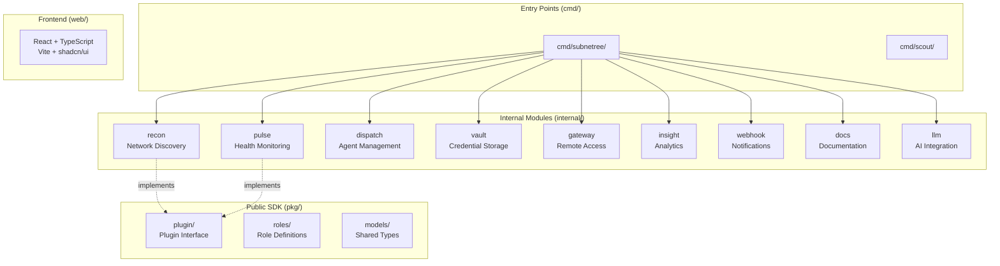
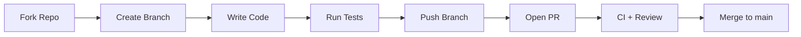
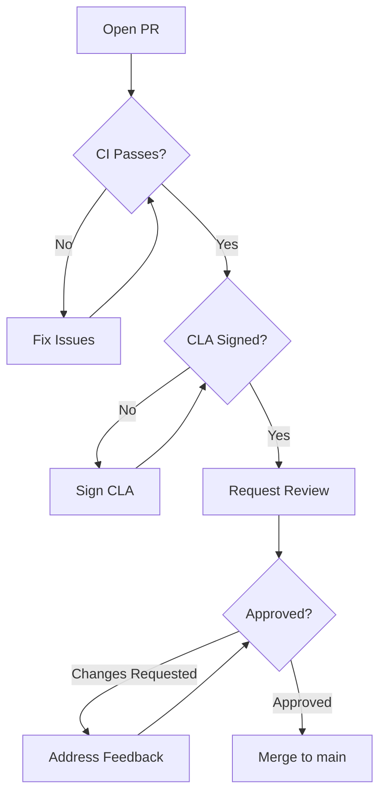
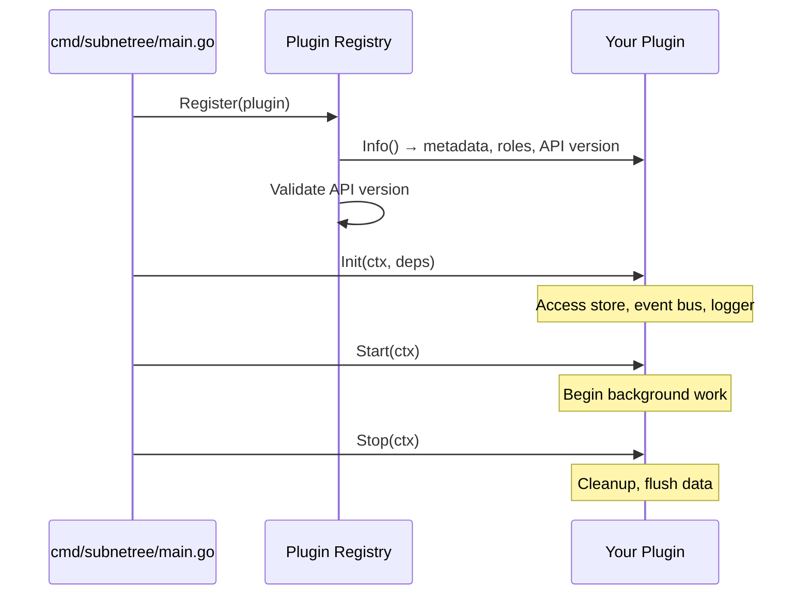

# Contributing to SubNetree

Thank you for your interest in contributing to SubNetree! This guide covers everything you need to get started.

## Contributor License Agreement (CLA)

All contributors must sign our [CLA](.github/CLA.md) before their first PR can be merged. This is automated -- the CLA bot will prompt you on your first pull request.

**Why a CLA?** SubNetree uses a split licensing model (BSL 1.1 + Apache 2.0). The CLA ensures we maintain a clean IP chain, which is essential for the project's long-term sustainability.

## Getting Started

### Prerequisites

- Go 1.25+
- Make (optional but recommended)
- Git

### Setup

```bash
# Fork and clone
git clone https://github.com/YOUR_USERNAME/subnetree.git
cd subnetree

# Build
make build

# Run tests
make test

# Run linter
make lint
```

### Project Structure

```text
cmd/            Entry points (server, agent)
internal/       Private packages (plugins, server, services)
pkg/            Public packages (plugin SDK, models)
api/proto/v1/   gRPC service definitions
docs/           Requirements, ADRs, guides
web/            React dashboard (Phase 2)
configs/        Example configuration files
```



## Development Workflow

**Every issue is developed on its own branch. No commits directly to `main`.**



1. **Fork** the repository and create a branch from `main`
2. **Branch naming** -- include the issue number when applicable:
   - `feature/issue-42-device-icons`
   - `fix/issue-17-scan-timeout`
   - `refactor/issue-30-plugin-lifecycle`
3. **Make your changes** -- follow the code style guidelines below
4. **Write tests** for new functionality
5. **Run checks:** `make test && make lint` -- all tests must pass before opening a PR
6. **Commit** using conventional commits (see below)
7. **Push** your branch and open a Pull Request against `main`
8. **Merge** only after CI passes and a maintainer approves

## Code Style

- **Formatting:** `gofmt` (enforced by CI)
- **Linting:** `golangci-lint` with the project configuration
- **Error handling:** Return errors, don't panic. Wrap errors with context.
- **Logging:** Use `go.uber.org/zap` structured logging (never `fmt.Println` or `log`)
- **Context:** Pass `context.Context` as the first parameter for cancellation/timeouts
- **Interfaces:** Define interfaces in the consumer package, not the provider
- **Tests:** Table-driven tests. Use `testify` for assertions.
- **SQL:** Raw SQL with thin repository layer. No ORM.
- **Comments:** Only where logic isn't self-evident. Don't add comments to code you didn't change.

## Commit Conventions

We use [Conventional Commits](https://www.conventionalcommits.org/):

```text
feat: add device type icon mapping
fix: prevent duplicate scan entries on network change
refactor: extract plugin lifecycle into separate package
docs: update API endpoint documentation
test: add integration tests for Recon module
chore: update golangci-lint to v1.62
```

- Keep the subject line under 72 characters
- Use the imperative mood ("add", not "added" or "adds")
- Reference issues when applicable: `fix: resolve scan timeout (#42)`

## Pull Request Process



1. Fill out the PR template completely
2. Ensure CI passes (build, test, lint, license check)
3. Request review from a maintainer
4. Address review feedback
5. Squash or rebase as needed before merge

## What to Contribute

### Good First Issues

Look for issues labeled [`good first issue`](https://github.com/HerbHall/subnetree/labels/good%20first%20issue) -- these are scoped, well-described tasks suitable for newcomers.

### Help Wanted

Issues labeled [`help wanted`](https://github.com/HerbHall/subnetree/labels/help%20wanted) are larger tasks where maintainers welcome community contributions.

### Bug Reports

Found a bug? [Open an issue](https://github.com/HerbHall/subnetree/issues/new?template=bug_report.md) with steps to reproduce.

### Feature Requests

Have an idea? Start a [discussion](https://github.com/HerbHall/subnetree/discussions) first -- we'll move it to an issue if it aligns with the roadmap.

### Plugin Ideas

Want to build a plugin? Check the [Plugin SDK documentation](pkg/plugin/) and open a [plugin idea issue](https://github.com/HerbHall/subnetree/issues/new?template=plugin_idea.md).

## Plugin Development

SubNetree's architecture is plugin-based. Every major feature is a plugin that implements the `plugin.Plugin` interface from `pkg/plugin/`.



- Plugins implement `Info()`, `Init()`, `Start()`, and `Stop()` methods
- Optional interfaces extend plugin capabilities: `HTTPProvider` (REST routes), `HealthChecker` (health reporting), `EventSubscriber` (event bus subscriptions)
- Plugins are registered at compile time in `cmd/subnetree/main.go`
- See [`pkg/plugin/`](pkg/plugin/) for the full SDK documentation

## Licensing

- Contributions to **core** code fall under BSL 1.1 (covered by the CLA)
- Contributions to the **Plugin SDK** (`pkg/plugin/`, `pkg/roles/`, `pkg/models/`, `api/proto/`) fall under Apache 2.0
- Do not introduce dependencies with GPL, AGPL, LGPL, or SSPL licenses. Run `make license-check` to verify.

## Questions?

- [GitHub Discussions](https://github.com/HerbHall/subnetree/discussions) for questions and ideas
- [Issue Tracker](https://github.com/HerbHall/subnetree/issues) for bugs and feature requests
